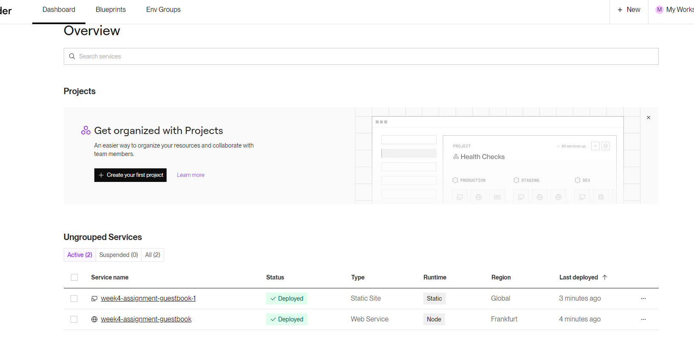
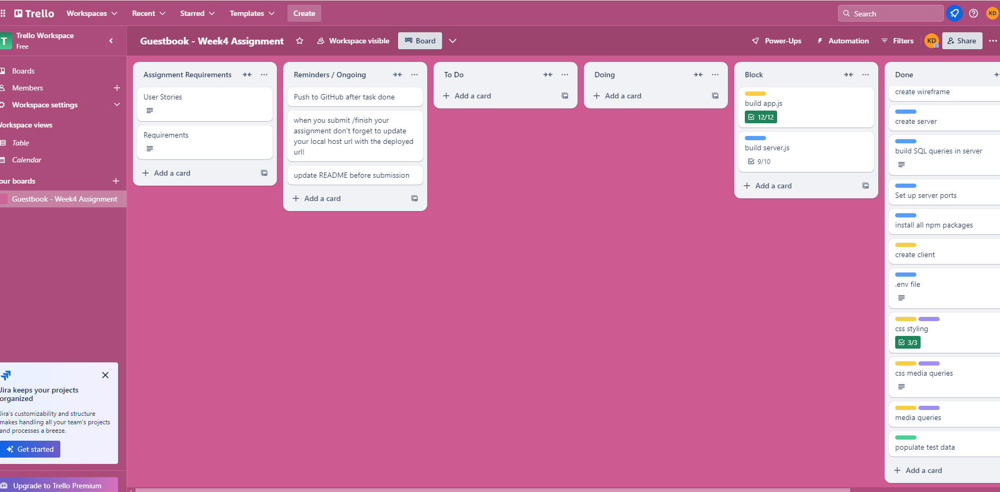

Client link: https://week4-assignment-guestbook-1-18k7.onrender.com

Server link: https://week4-assignment-guestbook-xwri.onrender.com

GitHub repo link

screenshot of wireframe  

I ran out of time to research how to change my ratings into stars when published on the browser.  
I managed to get my reviews from supabase to display on the browser and I managed to have my submitted forms turn into an object... it is unclear to me if they went to the server/db because I could not get them back.  
I encountered an error with my endpoints that I could not resolve so I opted to leave it and begin styling.

screenshot of deployment -- however I have not updated my URLs because it is not fully functional in testing.  

## Requirements

- Ensure your HTML form is working and submitting data into the database as expected.

  I thought I had done, I am unusre f this is where my error come from.

- Confirm that your project is functional on multiple screen sizes using either media queries or dynamic CSS styling.

  Done

- Create a working GET API route in your server.

  I thought I had done, I am unusre f this is where my error come from.

- Create a working POST API route in your server and fetch it from your client.

  I thought I had done, I am unusre f this is where my error come from.

- Seed your database with realistic-looking ‘dummy’ data through the Supabase query editor or a seed file in your server. Ensure that this is saved and submitted (in a screenshot or seed file form) so it can be marked and tested efficiently.  
  Done:
  
  
  

  Trello was also helpful:
  
